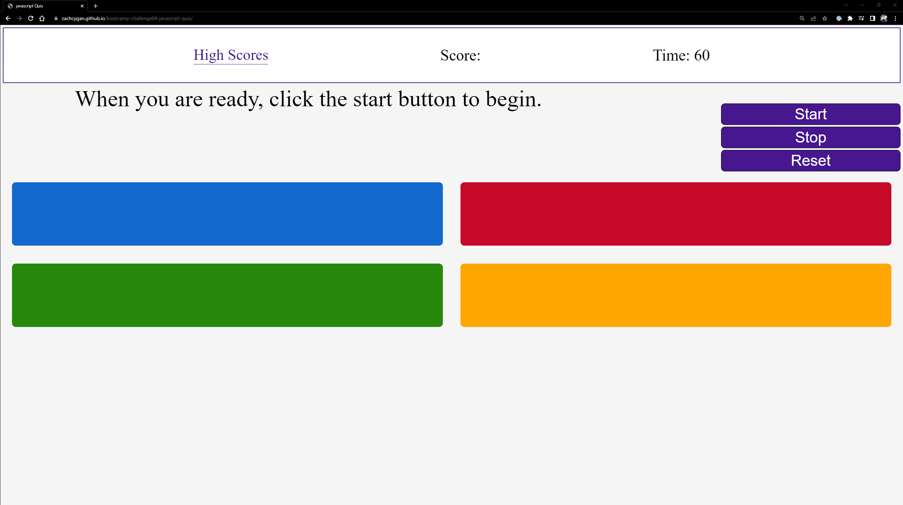
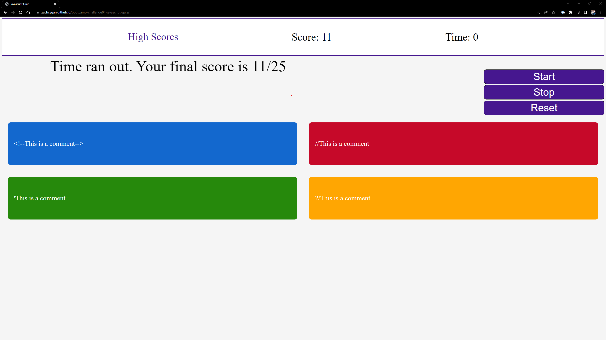
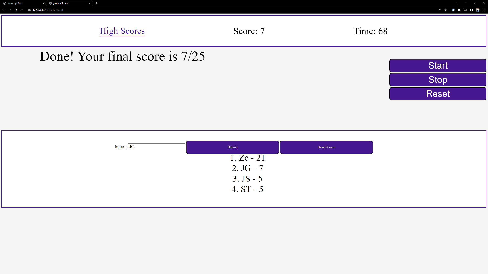

# <bootcamp-challenge04-Javascript-Quiz>

## Description

My motivation for this project is to make a simple javascript quiz that I, and others, and refer to for the basics. For any knowledgeable developer, this will be a very easy quiz. 

## Installation

The webpage is available at https://zachcygan.github.io/bootcamp-challenge04-javascript-quiz/. To view the source code within your browser, press F12 or right click the webpage and select "inspect" on windows. For MacOS,  press Command+Option+I or fn F12 (MacOS) to open Chrome DevTools. You can view any elements on the webpage or any of the styling by selecting the corresponding section in Chrome DevTools. 

## Instructions

To begin the game press the start button at any moment, you do not have to reset the game to start again. You may pause the game at any moment by pressing stop. This will stop the timer and prevent any questions from being completed. The reset button will reset the timer and place you on the initial home screen. At the end of a game, whethe the quiz is completed or the timer runs out, the user will be prompted to enter their intials. Their intitials and score will be saved locally. If at any time you would like to view the high scoes, click on high scores on the top left of the page. Whenever a question is answered correctly, the score will increase by 1. However, whenever the question is answered incorrectly, the timer will lose 1 second.

Screenshots of the finished webpage are shown below:

